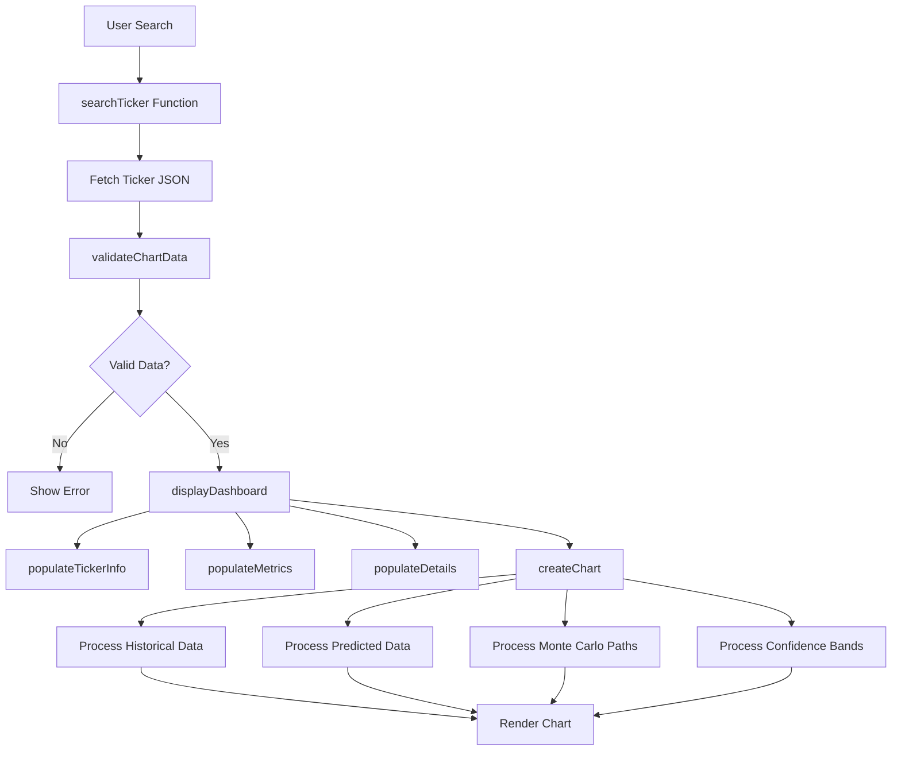

# Frontend JavaScript Code Analysis Report
## Transformers Predictions Ticker View

### Executive Summary

This report provides a comprehensive analysis of the frontend JavaScript code (`app.js`) in the Transformers Predictions application. The application is a sophisticated financial visualization tool that displays AI-powered stock predictions using transformer models with Monte Carlo simulation and confidence interval analysis.

---

## 1. Application Architecture Overview

### Core Components
- **OHLCVDashboard Class**: Main application controller
- **Chart.js Integration**: Financial data visualization using Chart.js with financial plugin
- **Responsive UI**: Adaptive design with loading states and error handling
- **Real-time Search**: Debounced ticker search with instant feedback

### Technology Stack
- **Frontend**: Vanilla JavaScript (ES6+ classes)
- **Charting**: Chart.js v4+ with chartjs-chart-financial plugin
- **Date Handling**: date-fns library with chartjs-adapter-date-fns
- **Interactivity**: chartjs-plugin-zoom for chart interactions
- **Styling**: CSS3 with modern features (gradients, animations, flexbox)

---

## 2. Data Loading and Processing Analysis

### 2.1 Data Sources

The application loads data from multiple JSON endpoints:

#### Primary Data Files
1. **Individual Ticker Data**: `data/{TICKER}_ohlcv_prediction.json`
2. **Market Summary**: `data/dataset_summary.json`
3. **Market Predictions**: `data/market_predictions.json`

#### Data Loading Flow
```javascript
// 1. Application Initialization
constructor() {
    this.loadSummaryStats();      // Overall market statistics
    this.loadPredictionsData();   // Market direction and predictions
    this.loadAvailableTickers();  // Popular ticker list
}

// 2. Ticker Search Flow
async searchTicker(ticker) {
    const jsonUrl = `data/${ticker}_ohlcv_prediction.json`;
    const response = await fetch(jsonUrl);
    // Direct file access - no API backend required
}
```

### 2.2 Error Handling Strategy
- **404 Handling**: Graceful "ticker not found" messages
- **Network Errors**: Generic error handling with user feedback
- **Data Validation**: `validateChartData()` ensures required structure exists
- **Fallback Values**: Default values when data is incomplete

---

## 3. Expected JSON Field Structure Analysis

### 3.1 Individual Ticker Data Structure

#### Required Top-Level Fields
```json
{
  "ticker_info": {
    "symbol": "AAPL",
    "generated_at": "2025-09-29T01:27:33.083047",
    "model_type": "kronos-120d-5d-montecarlo",
    "monte_carlo_runs": 10,
    "data_completeness": "full_120_day_history_with_monte_carlo",
    "chart_compatibility": "candlestick_ready"
  },
  "data": {
    "ticker": "AAPL",
    "metadata": {
      "lookback_start": "2025-04-07",
      "lookback_end": "2025-09-26",
      "lookback_days": 120,
      "prediction_start": "2025-09-29",
      "prediction_end": "2025-10-03",
      "prediction_days": 5,
      "monte_carlo_runs": 10
    }
  },
  "chart_data": { /* Chart visualization data */ },
  "summary_stats": { /* Performance metrics */ }
}
```

#### Chart Data Structure (Critical for Visualization)
```json
{
  "chart_data": {
    "historical_candlesticks": [
      {
        "date": "2025-04-07",
        "open": 177.2,
        "high": 194.15,
        "low": 174.62,
        "close": 181.46,
        "volume": 160466286.0
      }
    ],
    "predicted_candlesticks": [
      {
        "date": "2025-09-29",
        "open": 257.10859744383316,
        "high": 260.08144583379266,
        "low": 254.12980887197122,
        "close": 256.98131947134846,
        "volume": 59064956.525
      }
    ],
    "monte_carlo_paths": [ /* Array of simulation paths */ ],
    "prediction_percentiles": { /* Confidence intervals */ }
  }
}
```

### 3.2 Market Data Structure

#### Market Predictions JSON
```json
{
  "overall_direction": "BULLISH",
  "overall_accuracy": 87.2,
  "total_predictions": 10823,
  "last_updated": "2025-09-28T17:30:00Z",
  "top_predictions": [
    {
      "ticker": "AAPL",
      "direction": "BULLISH",
      "expected_change": 3.5,
      "confidence": 88.2,
      "target_price": 264.42,
      "current_price": 255.46
    }
  ],
  "market_summary": {
    "bullish_count": 3982,
    "bearish_count": 2619,
    "neutral_count": 25,
    "avg_confidence": 84.7,
    "high_confidence_count": 112
  }
}
```

---

## 4. Chart Rendering Logic Analysis

### 4.1 Chart.js Configuration

#### Chart Type and Plugins
```javascript
// Chart initialization with financial plugin
this.chart = new Chart(ctx, {
    type: 'line',  // Uses line charts, not native candlestick
    plugins: {
        zoom: { /* Zoom and pan functionality */ },
        legend: { display: false },  // Custom legend handling
        title: { /* Dynamic ticker symbol */ }
    }
});
```

#### Custom Candlestick Implementation
**Key Finding**: The application implements custom candlestick visualization using line datasets rather than the financial plugin's native candlestick type.

```javascript
// Historical candlestick rendering (lines 766-833)
historicalData.forEach((candle, index) => {
    const isBullish = candle.close >= candle.open;
    const color = isBullish ? '#26A69A' : '#EF5350';

    // Body (thick line from open to close)
    datasets.push({
        data: [
            { x: candle.date, y: candle.open },
            { x: candle.date, y: candle.close }
        ],
        borderWidth: 6,  // Thick line for body
        borderColor: color
    });

    // Upper and lower wicks (thin lines)
    // Separate datasets for high/low wicks
});
```

### 4.2 Prediction Visualization Strategy

#### Multiple Visualization Layers
1. **Historical Data**: Custom candlestick implementation
2. **Prediction Line**: Dashed orange line for median predictions
3. **Confidence Bands**: Multiple percentile-based bands
4. **Monte Carlo Paths**: Individual simulation trajectories

#### Dynamic Dataset Management
```javascript
// Toggle-based dataset inclusion
const show90 = document.getElementById('showConfidence90')?.checked;
const show75 = document.getElementById('showConfidence75')?.checked;
const show50 = document.getElementById('showConfidence50')?.checked;
const showMonteCarloLines = document.getElementById('showMonteCarloLines')?.checked;

// Conditional dataset addition based on user preferences
if (show90 && percentileData.p10 && percentileData.p90) {
    datasets.push(/* 90% confidence band datasets */);
}
```

---

## 5. Monte Carlo Paths Visualization

### 5.1 Data Structure Requirements

#### Monte Carlo Paths Format
```json
{
  "monte_carlo_paths": [
    [
      {
        "date": "2025-09-29",
        "open": 255.6047040587808,
        "high": 258.07804728460997,
        "low": 252.93596475956974,
        "close": 255.40420668215577,
        "volume": 67027859.81492554
      }
    ]
  ]
}
```

### 5.2 Visualization Implementation

#### Path Rendering Logic (Lines 1107-1161)
```javascript
monteCarloPath.forEach((path, i) => {
    // Handle both OHLCV objects and simple number arrays
    const lineData = predictedData.map((pred, j) => {
        let value;
        if (typeof path[j] === 'object' && path[j] !== null) {
            value = path[j].close;  // Extract close price from OHLCV
        } else {
            value = path[j];  // Use direct number value
        }
        return { x: pred.date, y: value };
    });

    // Color coding based on final return
    const finalPrice = /* calculate final price */;
    const returnPct = (finalPrice - lastHistoricalClose) / lastHistoricalClose;

    let color;
    if (returnPct > 0.02) color = 'hsla(120, 60%, 50%, 0.25)';      // Green
    else if (returnPct < -0.02) color = 'hsla(0, 60%, 50%, 0.25)';  // Red
    else color = 'hsla(45, 60%, 50%, 0.25)';                       // Yellow
});
```

#### Key Features
- **Dynamic Color Coding**: Paths colored by final performance
- **Transparency**: Semi-transparent lines to avoid visual clutter
- **Performance-Based Grouping**: Green (gains), Red (losses), Yellow (neutral)

---

## 6. Confidence Bands Implementation

### 6.1 Percentile Data Structure

#### Two Format Support
```javascript
// Format 1: Array-based percentiles (legacy)
{
  "prediction_percentiles": {
    "p10": [252.18, 251.45, ...],
    "p25": [252.48, 252.12, ...],
    "p50": [255.98, 256.23, ...],
    "p75": [260.25, 261.45, ...],
    "p90": [264.10, 265.88, ...]
  }
}

// Format 2: Date-based percentiles (current)
{
  "prediction_percentiles": {
    "2025-09-29": {
      "close": {
        "p10": 252.1817370886164,
        "p25": 252.4791905236629,
        "p50": 255.97872880385773,
        "p75": 260.2527321162506,
        "p90": 264.0994634327767,
        "mean": 256.98131947134846,
        "std": 4.7117437367898205
      }
    }
  }
}
```

### 6.2 Band Rendering Implementation

#### Confidence Level Mapping
- **90% Confidence**: p10 to p90 (widest band)
- **75% Confidence**: p25 to p75 (medium band)
- **50% Confidence**: p37.5 to p62.5 (interpolated inner band)

#### Fill Strategy
```javascript
// Upper and lower bounds as separate datasets
datasets.push({
    label: '90% Confidence Upper',
    data: upperData,
    fill: false
});
datasets.push({
    label: '90% Confidence Lower',
    data: lowerData,
    fill: '-1'  // Fill to previous dataset (creates band)
});
```

---

## 7. Potential Data Format Mismatches

### 7.1 Critical Issues Identified

#### 1. Monte Carlo Data Format Inconsistency
**Issue**: The code handles both OHLCV objects and simple number arrays for Monte Carlo paths
```javascript
// Problematic dual format handling
if (typeof path[j] === 'object' && path[j] !== null) {
    value = path[j].close || pred.close;  // OHLCV object
} else {
    value = path[j] || pred.close;        // Simple number
}
```
**Risk**: Data format changes could break visualization

#### 2. Percentile Format Migration
**Issue**: Code supports two different percentile formats
**Risk**: Legacy format support may be deprecated without notice

#### 3. Missing Validation for Required Fields
**Current Validation**:
```javascript
validateChartData(data) {
    return data.chart_data &&
           data.chart_data.historical_candlesticks &&
           data.chart_data.predicted_candlesticks;
}
```
**Missing**: Validation for Monte Carlo paths and percentile data

### 7.2 Recommendations for Data Consistency

1. **Standardize Monte Carlo Format**: Choose either OHLCV objects or simple arrays
2. **Add Comprehensive Validation**: Check for all expected data structures
3. **Version Data Schemas**: Include schema version in JSON files
4. **Error Recovery**: Better handling when optional data is missing

---

## 8. Data Flow Documentation

### 8.1 Complete Data Pipeline



### 8.2 Chart Update Flow

#### Toggle-Based Updates
```javascript
// Chart control event listeners (lines 50-72)
document.getElementById('showPredictionBands')?.addEventListener('change', () => {
    this.updateChart();  // Regenerates entire chart
});

updateChart() {
    if (this.currentData) {
        this.createChart(this.currentData);  // Full recreation
    }
}
```
**Note**: Chart updates trigger complete recreation rather than incremental updates

---

## 9. Performance Considerations

### 9.1 Chart Rendering Performance

#### Potential Bottlenecks
1. **Full Chart Recreation**: Every toggle recreates the entire chart
2. **Large Dataset Handling**: 120 days of historical data + Monte Carlo paths
3. **Multiple Dataset Management**: Each chart element is a separate dataset

#### Current Optimizations
```javascript
// Canvas cleanup before recreation
if (this.chart) {
    this.chart.destroy();
    this.chart = null;
}
ctx.clearRect(0, 0, canvas.width, canvas.height);
```

### 9.2 Memory Management
- **Chart Destruction**: Properly destroys Chart.js instances
- **Data Filtering**: Removes invalid data points before rendering
- **Event Cleanup**: No explicit event listener cleanup (potential leak)

---

## 10. UI/UX Analysis

### 10.1 Interaction Features

#### Search Experience
- **Real-time Search**: 300ms debounce for smooth typing
- **Auto-capitalization**: Ticker symbols auto-converted to uppercase
- **Fallback Display**: Returns to summary view when search cleared

#### Chart Interactivity
- **Zoom and Pan**: Full Chart.js zoom plugin integration
- **Reset Functionality**: One-click zoom reset
- **Toggle Controls**: Individual control over each visualization layer

### 10.2 Visual Design Patterns

#### Color Scheme
- **Historical Data**: Green (#26A69A) for bullish, Red (#EF5350) for bearish
- **Predictions**: Orange (#FF6B35) for prediction line
- **Confidence Bands**: Blue/Green/Orange with varying opacity
- **Monte Carlo**: HSL color coding based on performance

#### Typography and Layout
- **Responsive Design**: Flexible layout with max-width containers
- **Modal Information**: Detailed metric explanations on demand
- **Loading States**: Spinner animations and skeleton screens

---

## 11. Code Quality Assessment

### 11.1 Strengths
1. **Modular Architecture**: Well-organized class-based structure
2. **Error Handling**: Comprehensive error states and user feedback
3. **Data Validation**: Input validation before chart creation
4. **Browser Compatibility**: Modern ES6+ with graceful degradation
5. **Accessibility**: Keyboard navigation and focus management

### 11.2 Areas for Improvement

#### Code Organization
```javascript
// Large function (createChart) could be broken down
createChart(data) {
    // 500+ lines of chart configuration
    // Recommendation: Extract helper methods
}
```

#### Magic Numbers
```javascript
// Hard-coded values should be constants
borderWidth: 6,        // Candlestick body width
borderWidth: 0.8,      // Monte Carlo line width
timeout: 300,          // Search debounce timeout
```

#### Error Recovery
```javascript
// Limited fallback when data is partially missing
if (!hasMonteCarloData) {
    // Currently shows nothing
    // Could show estimated confidence bands
}
```

---

## 12. Security Considerations

### 12.1 Client-Side Security
- **XSS Protection**: No direct HTML injection from user input
- **Data Validation**: Input sanitization for ticker symbols
- **HTTPS Only**: All external CDN resources use HTTPS

### 12.2 Recommendations
1. **Input Validation**: Add stricter ticker symbol validation
2. **CSP Headers**: Implement Content Security Policy
3. **CORS Configuration**: Proper CORS setup for data endpoints

---

## 13. Browser Compatibility

### 13.1 Modern Features Used
- **ES6 Classes**: Requires modern browser support
- **Async/Await**: ES2017 feature for promise handling
- **CSS Custom Properties**: Modern CSS features
- **Fetch API**: No fallback to XMLHttpRequest

### 13.2 Dependency Analysis
```javascript
// External dependencies from CDN
Chart.js                    // v4+ (modern)
chartjs-chart-financial     // Financial charts
date-fns                    // Date manipulation
chartjs-adapter-date-fns    // Date scaling
chartjs-plugin-zoom         // Zoom functionality
```

---

## 14. Recommendations

### 14.1 Immediate Improvements
1. **Add Schema Validation**: Comprehensive data structure validation
2. **Performance Optimization**: Incremental chart updates instead of recreation
3. **Error Boundaries**: Better handling of partial data failures
4. **Memory Management**: Explicit event listener cleanup

### 14.2 Long-term Enhancements
1. **Real-time Updates**: WebSocket integration for live data
2. **Caching Strategy**: Client-side caching for frequently accessed tickers
3. **Progressive Loading**: Lazy loading of historical data
4. **Accessibility**: Screen reader support and ARIA labels

---

## 15. Conclusion

The frontend code demonstrates a sophisticated understanding of financial data visualization with strong technical implementation. The Chart.js integration is well-executed, handling complex multi-layer visualizations including custom candlestick rendering, Monte Carlo simulation paths, and confidence intervals.

**Key Strengths**:
- Robust data handling with multiple format support
- Sophisticated visualization capabilities
- Strong user experience with responsive design
- Comprehensive error handling

**Critical Areas**:
- Data format consistency needs standardization
- Performance optimization opportunities exist
- Code organization could be improved for maintainability

The application successfully achieves its goal of presenting complex AI-driven financial predictions in an accessible, interactive format suitable for both technical and non-technical users.